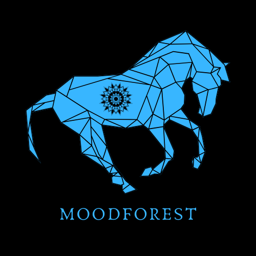

# moodforest
### [PLAY](https://moodforest.com)

## STEPS TO RUN
* Install ganache and run it.
* Open metamask and connect an account with ganache
* `truffle compile`
* `truffle migrate`  or `truffle migrate --reste`

## About Moodforest

1) Get free animal
2) Get paid annimal (Better ones - Dragon, Unicorn, ...)
3) Create an animal Animal reference (Annimal + color + mood) + code => Hash on the blockchain (Commit-Reveal)
4) publis on facebook the link
5) friends make bets
6) reveal the result and check who win
7) add it to the winner "forest" with reference to the creator

Annimal:
    1 - lion
    2- Rabit
    ...
    
Color:
1 - Red
2 - Blue
3 - Green
...
Mood:
    1 - Happy
    2 - Sad
    3 - embaras
    ...
    
We want to add mixing between animals if we have time....
If you have win a lion and a rabit you can create a rabit lion

Smart contract:
    
    screen:
    screen 1:
    if no animal:
        Adding an animal:
            -choose animal
            -choose color
            -choose mood
            ==> addItemTest(uint8 animal, uint8 color, uint8 feeling, uint64 random) external payable returns(address address_sender)
        => eth address used to call the function
   creating the link with address as parameter
     post on Facebook
    else:
        => display number of bet
        check animal:
        ==> checkBet(uint8 animal, uint8 color, uint8 feeling, uint64 random) external payable returns (uint16 nb_win_ret);
            => display number of animal found
            
    
    screen 2:
        from a link
 check if there is an animal to guess at this address
let the user choose 
-an animal
- a color
- a mood
make a bet
==> addBet(address player, uint8 animal, uint8 color, uint8 feeling) public payable
    
    screen 3:
        display list of animal found by other users
        ==> getListItem(uint8 i) external view returns(uint8 animal, uint8 color, uint8 feeling, address owner)
        display list of animal found by the user
    ==> getListWin(uint8 i) external view returns(uint8 animal, uint8 color, uint8 feeling, address owner)
    
    Create an annimal:
        easy way for testing: 
            addItemTest(uint8 animal, uint8 color, uint8 feeling, uint64 random) external payable returns(address address_sender)
        normal way with hash:
            addItem(bytes32 item) external payable
    
    Add a bet:
        addBet(address player, uint8 animal, uint8 color, uint8 feeling) public payable
    
    Check result:
        checkBet(uint8 animal, uint8 color, uint8 feeling, uint64 random) external payable returns (uint16 nb_win_ret);
        
    Get list of win:
        for (end when return 0,0,0,0)
        getListWin(uint8 i) external view returns(uint8 animal, uint8 color, uint8 feeling, address owner)

Get list of annimal discovered
for (end when return 0,0,0,0)
getListItem(uint8 i) external view returns(uint8 animal, uint8 color, uint8 feeling, address owner)

